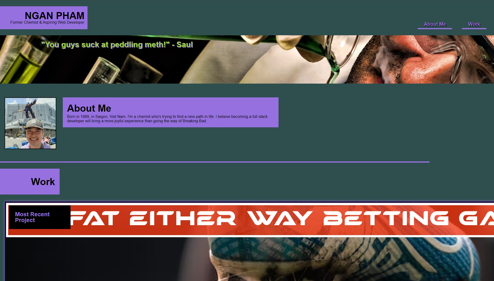

# My-Portfolio

This is the code for a webpage that has my introduction, contact informations, and links to all of my notable projects.

You can find my portfolio [here](https://nganpham89.github.io/My-Portfolio/)

# Screenshots

## About this project

There are a few motivations behind this project.

* Create a platform to showcase my most valued works and my information.
* Working on HTML and advanced CSS techniques.
* Working with images, create links with them, and arranging them using flexbox.
* Create a responsive website that will render on mobile devices.
* Experimenting with various selectors.

## To-dos

* HTML and CSS optimizations
* Interactive elements
* Improving the page overall design
